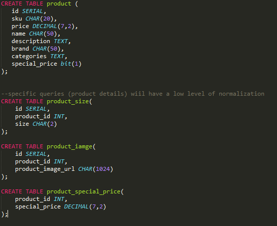
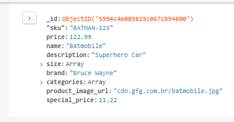
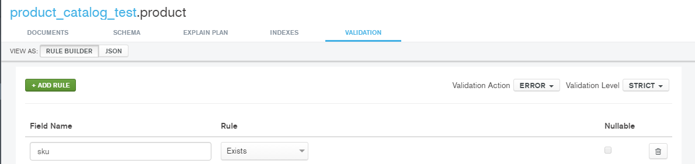

# Case Study Tech

- You don't have a lock in time to finish, but we know how long it takes to be
  done, so use your good sense.
- Your answers can be in English or Portuguese, whatever you prefer.
- All non-human help is allowed. You can use the Internet and any site and
  tools you want. If you have questions about the tasks please don't hesitate to
  ask!
- Visit the case study on [GitHub](https://github.com/dafiti/product-catalog-test)
- Create a fork for this repository git@github.com:dafiti/product-catalog-test.git
  and clone it.
- Solve the tasks as described.
- After you finished, please create a Pull Request for the master branch at
  git@github.com:dafiti/product-catalog-test.git

## Your tools
- [Spring Tool Suite](https://spring.io/tools/ggts/all)
- [Git client/ Git Windows](https://git-scm.com)
- [Java JDK](http://www.oracle.com/technetwork/pt/java/javase/downloads/jdk8-downloads-2133151.html)


## The project
Product Catalog

### Description
You and your team have the task to design and build a new product catalog for
the Dafiti E-Commerce platform.

## Your tasks
1. Design two alternative Storage solutions and describe advantages and
   drawbacks of either approach. Think about high number of concurrent requests
   (moderate write, heavily read). It can be different database strucutures or
   even completly different database products (only requirement is it needs to
   be opensource)

## Alternative One:
  Deploying a postgreSQL server and using for the major queries a dirties reads, setting the isolation level for read uncommitted
  postgre and oracle has a pretty good solution taking  the considerations of heavily reads with moderated writes
  no extensive normalization looking for avoid jumps on queries.
  master/slave sctructure for replication and balance
  deploy server using the following schema: (only for product)

 

## Alternative Two:
  Deploying a MongoDB database upper 3.0vs, 
  settign replica set for balance the reads and write tasks 
  

  Validation for product identifier 
  


2. Write a filter and a validation for the input data of the WMS (service as
   described below, take care of the specification). You can use a language of
   your choice, no pseudo-code is allowed, no framework must be used.
   Note: We should be somehow able to execute the solution (e.g. run script,
   executable, unit test, etc.).
## [Validation](src/main/java/demo/validation/ProductJson.java) 


*How to present your solution:* WRITE CODE IN WHATEVER LANGUAGE YOU WANT
 (REMEMBER: WE NEED TO BE ABLE TO RUN THE CODE, SO PLEASE TELL US HOW, E.G.
 IN A SEPARATE MARKDOWN FILE - OR IF YOUR ARE CUTTING EDGE PROVIDE A DOCKER
 FILE WHICH WORKS OUT-OF-THE-BOX)


3. Describe or implement a solution to handle temporary and permanent failure
   of the involved webservices (language of choice, pseudo-code allowed,
   external tools or frameworks allowed). As the time might be already tight,
   at least sketch out some ideas.

##  [Answer](task_3_recoveryAndBadRequestSit.txt) || [Code](NotIMplemente.java)

## Technical Details
There are a couple of backend webservices involved. You don't need to care about
how the data is requested (e.g. REST, Thrift or something else). For our purpose
we will use a simple JSON file as input data to validate your implementation.
Use [this file](wms_product_data.json) for example data.
To avoid confusion we added [this diagram](product_catalog_test.png) showing the
relations between the services.

### WMS webservice (warehouse management system)
- async possible
- data can be imported
- it is likely that new attributes will be added)
- will always send a batch between 0 and N products which has been changed or
  added in the WMS since the last call (delta)

```
Input Parameters: <NONE>
Output:
0..n
    sku -> required, String
    price -> required, Double (Int can be converted to Double)
    name -> required, String
    description-> required, String
    size -> required, Mixed (return value can be an array list or single value)
    brand -> required, String
    categories -> required, Array
    product_image_url -> required, String, valid URL, valid image extension (jpg, jpeg, png, gif), http as protocol can be prepended if domain is valid
    special_price -> optional, Double (Int can be converted to Double)
```


### Stock webservice
- realtime
- required

```
Input Parameters:
    sku -> String
    size -> String
Output:
0..1
    quantity -> Int
    warehouse -> String
```

### CMS webservice
- async possible
- cachable
- acceptable to go without
- there is a default placeholder text if not available

```
Input Parameters:
    sku -> String|category -> string
Output:
0..n
    content -> String
    region -> String
```

